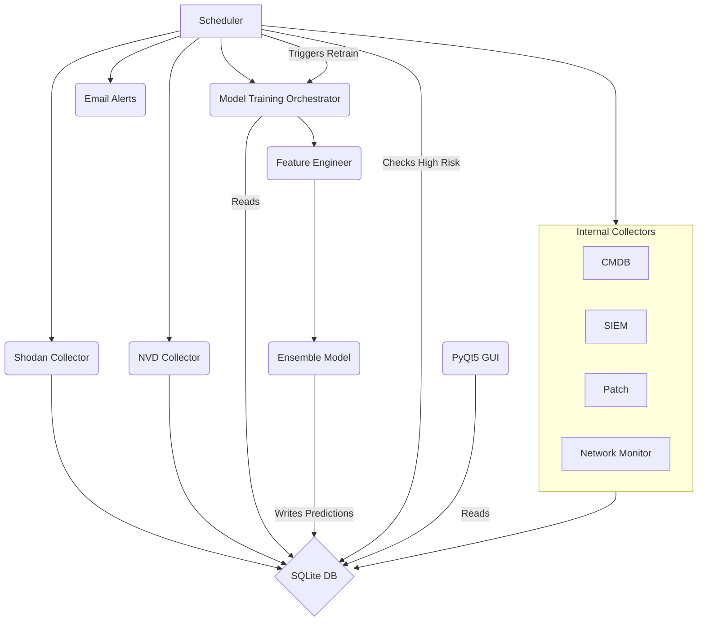

# ThreatSentry AI: AI-Powered Threat Hunting Dashboard

[](https://opensource.org/licenses/MIT)
[](https://www.python.org/downloads/)
[](https://www.qt.io/qt-for-python)
[](https://scikit-learn.org/)


## 👤 Author & Acknowledgment

This project was conceptualized and developed by **EclipseManic**.

AI development tools were utilized to assist in code generation, documentation, and refinement, enabling a single developer to build a comprehensive and robust application.

---

## 📖 Overview

In today's complex cybersecurity landscape, security teams are often overwhelmed by a flood of alerts and data from disparate systems. This "alert fatigue" leads to a reactive security posture, where analysts are constantly chasing threats rather than getting ahead of them.

**ThreatSentry AI** transforms this paradigm by providing a proactive, AI-driven threat hunting platform. It automates the lifecycle of threat discovery and risk assessment, starting with identifying external-facing assets via Shodan. It then enriches these assets with vulnerability data from the NVD and crucial context from internal systems (like CMDB, SIEM, patch management, and network monitoring). Most importantly, it uses a sophisticated machine learning model to **predict and prioritize risk** based on this comprehensive dataset. This allows security teams to focus their limited resources on the assets that pose the greatest threat, enabling intelligent and efficient threat hunting.

---

## ✨ Key Features

* **🤖 AI-Powered Risk Scoring**:
    * Utilizes an advanced **ensemble machine learning model** (Scikit-learn based: Random Forest, Gradient Boosting, MLP Neural Network) for accurate risk classification.
    * Generates a clear risk label (**Low, Medium, High**) and a confidence score for every discovered asset.
    * Leverages **advanced feature engineering**, incorporating data beyond basic vulnerabilities. It considers temporal patterns (`exposure_days`, `patch_lag_days`), network context (`network_segment`, `firewall_rules_count`), service context (`is_critical_service`, `data_sensitivity_level`), behavioral anomalies (`auth_failures_24h`, `traffic_anomaly_score`), and compliance requirements (`compliance_requirements`) to assess risk holistically.

* **🌐 Automated Asset Discovery & Multi-Source Enrichment**:
    * Integrates with the **Shodan API** to continuously discover internet-facing devices and services based on configurable queries.
    * Automatically enriches discovered assets with vulnerability data from the **National Vulnerability Database (NVD)**, correlating services with known CVEs using improved banner parsing.
    * **Integrates with internal systems** (placeholders provided, require implementation) to gather crucial context:
        * **CMDB Collector**: Adds asset context like network segment, criticality, compliance needs.
        * **SIEM Collector**: Gathers behavioral data like authentication failures.
        * **Patch Management Collector**: Determines patch lag days.
        * **Network Monitor Collector**: Provides traffic anomaly scores.
    * Stores all consolidated asset information in a centralized SQLite database.

* **🖥️ Intuitive Threat Dashboard**:
    * A clean and responsive Graphical User Interface (GUI) built with **PyQt5** provides a centralized view of all assets and their predicted risk posture.
    * Visualizes the overall risk distribution with an interactive bar chart (Matplotlib) and presents detailed information in a sortable, filterable, color-coded table.
    * Allows manual actions: trigger scans (Shodan + enrichment), upload asset data (CSV/JSON, supporting advanced fields), initiate model retraining, and send manual email alerts.
    * 


* **📧 Proactive Email Alerting**:
    * Automatically generates and sends **detailed HTML email alerts** via SendGrid for newly discovered high-risk devices (Risk Label = 2).
    * Alerts provide a clear summary, risk factors (including CVSS, open ports), and actionable remediation guidance to accelerate response.
    * Includes a "mark as notified" system (`notified` flag in DB) to prevent duplicate alerts for the same high-risk device.

* **📈 Model Monitoring & Feedback**:
    * Includes modules for monitoring model performance over time, detecting potential data drift, and checking model health.
    * Provides a feedback system allowing manual correction of risk labels, which can be used to adjust model weights and retrain the model for continuous improvement.

---

## 🛠️ Technologies Used

* **Backend:** Python 3.9+
* **GUI:** PyQt5
* **Machine Learning:** Scikit-learn (Random Forest, Gradient Boosting, MLP), NumPy, Joblib
* **Data Handling:** Pandas
* **Data Collection:** Shodan API (`shodan`), NVDLib (`nvdlib`), Requests (`requests`)
* **Database:** SQLite (via SQLAlchemy ORM)
* **Email Alerts:** SendGrid API (`sendgrid`)
* **Scheduling:** APScheduler (`apscheduler`)
* **Configuration:** Python Dotenv (`python-dotenv`)
* **Plotting:** Matplotlib

---

## ⚙️ How It Works (Architecture)

The application operates in a continuous, cyclical workflow managed by the **Scheduler**:

1.  **Collect (External Scan)**: The **Shodan Collector** scans for internet-facing devices based on configured queries. Basic device information (IP, Org, Country, Ports, Banners) is saved or updated in the **SQLite database**.
2.  **Enrich (Vulnerabilities)**: The **NVD Collector** queries the National Vulnerability Database for CVEs related to services identified in the banners, updating the device's vulnerability list, `cve_count`, and `max_cvss` in the database.
3.  **Enrich (Internal Context)**: A series of **Internal Collectors** are triggered to add business and security context (*Note: These require implementation specific to your environment*):
    * **CMDB Collector**: Adds data like network segment, criticality, compliance needs.
    * **SIEM Collector**: Adds behavioral metrics like auth failures.
    * **Patch Collector**: Adds patch lag information.
    * **Network Monitor Collector**: Adds traffic anomaly scores.
4.  **Analyze & Predict**: The **Model Training Orchestrator** loads the fully enriched data from the database. The **Feature Engineer** transforms this data into a numerical feature set. The pre-trained **Ensemble Model** predicts a risk label (`risk_label`) and confidence score (`confidence_score`) for each device. These predictions are stored back in the database.
5.  **Visualize**: The **PyQt5 GUI** reads the latest data (including predictions) from the database and presents it to the user in an interactive dashboard.
6.  **Alert**: The **Scheduler** periodically checks for new high-risk devices (`risk_label == 2`) that haven't been notified (`notified == False`) and triggers the **Email Alerts** module to send notifications.
7.  **(Optional) Retrain**: Periodically (based on `RETRAIN_ON_SCHEDULE` and `RETRAIN_INTERVAL_MINUTES`), the **Scheduler** triggers the **Model Training Orchestrator** to retrain the ensemble model using the latest data in the database.



## 🧩 Getting Started

### Prerequisites
- **Python 3.9+**
- API Keys / Credentials for:
  - **Shodan** (Required for external asset discovery)
  - **SendGrid** (Required for email alerts, must have a verified sender email)
  - **Your Internal Systems** (CMDB, SIEM, Patch Management, Network Monitoring)
    - Implement your connection logic inside their respective collector files.

---

## ⚙️ Installation

### 1. Clone the repository
```bash
git clone https://github.com/EclipseManic/ThreatSentry-AI.git
cd ThreatSentry-AI
```

### 2. Create and activate a virtual environment
```bash
python -m venv venv

# On Windows:
venv\Scripts\activate

# On macOS/Linux:
source venv/bin/activate
```

### 3. Install required dependencies
```bash
pip install -r requirements.txt
```

---

## 🔐 Configuration

### 1. Environment Variables (`.env` file)
Create a `.env` file in the root directory with the following structure:

```bash
# --- Shodan API Key (Required) ---
SHODAN_API_KEY="YOUR_SHODAN_API_KEY"

# --- SendGrid Email Alerts (Required) ---
SENDGRID_API_KEY="YOUR_SENDGRID_API_KEY"
SENDER_EMAIL="your_verified_sender@example.com"
ALERT_RECIENTS="recipient1@example.com,recipient2@example.com"

# --- Database ---
SQLITE_PATH="threat_sentric_ai.db"

# --- Model ---
MODEL_PATH="threatsentry_model.pkl"

# --- Scheduler ---
SCAN_INTERVAL_MINUTES="30"
RETRAIN_INTERVAL_MINUTES="60"
RETRAIN_ON_SCHEDULE="True"

# --- Shodan Query Behavior Control ---
SHODAN_QUERY=""
SHODAN_QUERY_EMPTY_TO_PRESET="True"

# --- Logging ---
LOG_LEVEL="INFO" # DEBUG, INFO, WARNING, ERROR, CRITICAL

# --- Internal System Credentials (Optional - Add as needed for your collectors) ---
# CMDB_API_ENDPOINT="..."
# CMDB_API_KEY="..."
# SIEM_API_ENDPOINT="..."
# SIEM_API_KEY="..."
# PATCH_API_ENDPOINT="..."
# PATCH_API_KEY="..."
# NETWORK_MONITOR_ENDPOINT="..."
# NETWORK_MONITOR_KEY="..."
```

> The app loads environment variables via `os.getenv()` in `config.py`.  
> Never commit this file to version control.

---

## 🔍 Shodan Query Presets (`config.py`)

Modify the `SHODAN_QUERIES` dictionary to define your custom query presets:

```python
SHODAN_QUERIES = {
    "default": "product:apache",
    "org": 'org:"Your Company Name"',
    "net": 'net:"123.45.67.0/24"',
    "ssl": 'ssl:"yourcompany.com"',
    "hostname": 'hostname:".yourcompany.com"',
    "rdp": 'port:3389 "remote desktop"',
    "mongodb": 'port:27017 "mongodb"',
    "ics_modbus": 'port:502 "modbus"',
    "vuln_example": 'vuln:CVE-2024-12345',
    "http_login": 'http.title:"Login" org:"Your Company"'
}
```

If `SHODAN_QUERY` in `.env` is empty **and** `SHODAN_QUERY_EMPTY_TO_PRESET=True`,  
the scheduler will automatically cycle through these presets.

---

## 🧠 Implementing Internal Collectors

> ⚠️ **Important:** The internal collectors (`cmdb_collector.py`, `siem_collector.py`, `patch_collector.py`, `network_monitor_collector.py`) are **placeholders**.  
> Replace the placeholder logic with real integrations to your systems.

You’ll need to:
- Fetch internal data using APIs, databases, or SDKs.
- Map fetched data to the `Device` model attributes.
- Update the database session with this enriched information.

Without these integrations, the model will lack context for accurate predictions.

---

## 🧪 Running the Application

### (Optional) Generate Initial Training Data
```bash
python scripts/generate_realistic_training_data.py --count 1000
```
Creates `scripts/my_training_data.json`.  
You can upload this file through the GUI’s **Upload** option to initialize training data.

### Launch the Application
```bash
python run.py
```
The GUI will open and the scheduler will start scanning, enriching, and predicting automatically.

---

## ⚡ Quick Demo with Generated Data

1. Complete installation (steps 1–3).  
2. Set up your `.env` file (even with placeholder keys).  
3. Optionally adjust Shodan presets in `config.py`.  
4. Generate data:
   ```bash
   python scripts/generate_realistic_training_data.py --count 500
   ```
5. Launch the app:
   ```bash
   python run.py
   ```
6. In the GUI:
   - Select **Upload** → Choose `scripts/my_training_data.json`
   - Click **Refresh** to view populated device data and risk levels.

---

## 🛠️ Scripts and Usage Guide

| Script | Description |
|--------|--------------|
| **run.py** | Main entry point. Starts DB, scheduler, and GUI. |
| **scheduler.py** | Handles periodic scanning, enrichment, prediction, and retraining. |
| **scripts/generate_realistic_training_data.py** | Generates realistic training data for testing or bootstrapping. |
| **scripts/clear_db_enhanced.py** | Interactively clean database or reset notification flags. |
| **scripts/reset_db.py** | Completely resets the database. Use with caution. |

### Example Commands

```bash
# Generate 1000 records
python scripts/generate_realistic_training_data.py --count 1000

# View cleanup options
python scripts/clear_db_enhanced.py --help

# Delete all devices & vulnerabilities
python scripts/clear_db_enhanced.py --delete-devices --delete-vulns

# Reset notified flag
python scripts/clear_db_enhanced.py --reset-notified

# Dangerous full reset
python scripts/reset_db.py
```

---

## 💬 Feedback & Suggestions

This project was developed by **EclipseManic**.  
While code contributions are currently closed, your **feedback and bug reports** are highly appreciated.

Please open an [Issue](https://github.com/EclipseManic/ThreatSentry-AI/issues) to share your thoughts or report a problem.

---

## 📄 License

This project is licensed under the **MIT License**.  
See the [LICENSE](./LICENSE) file for details.
